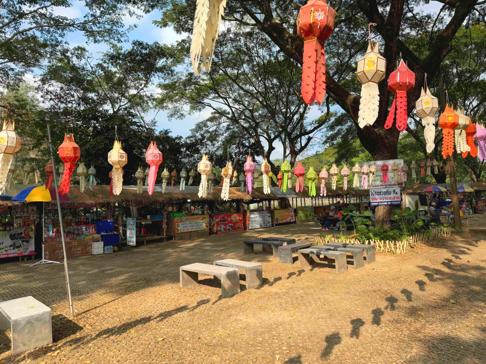
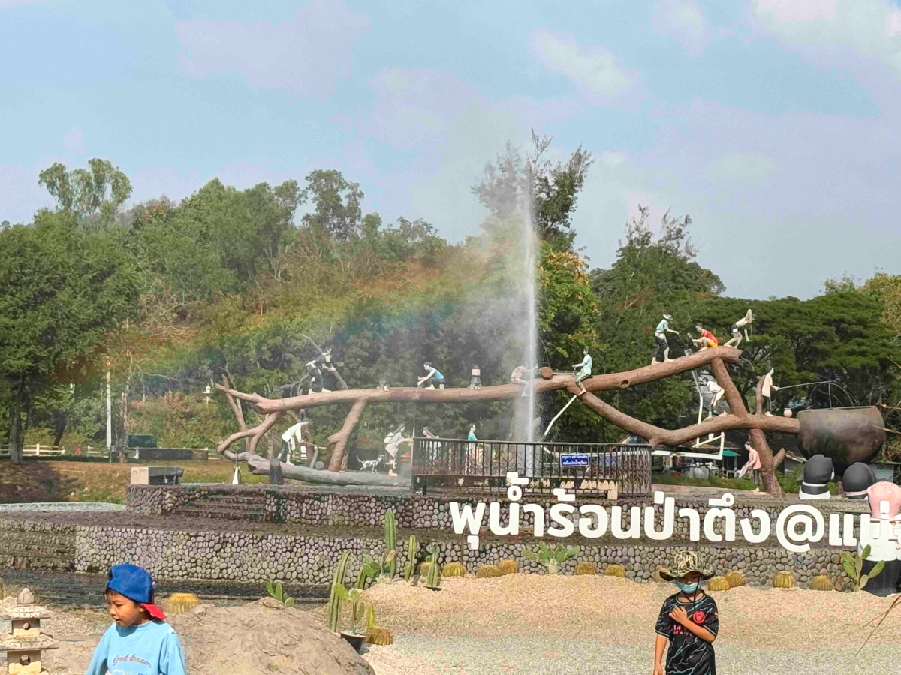
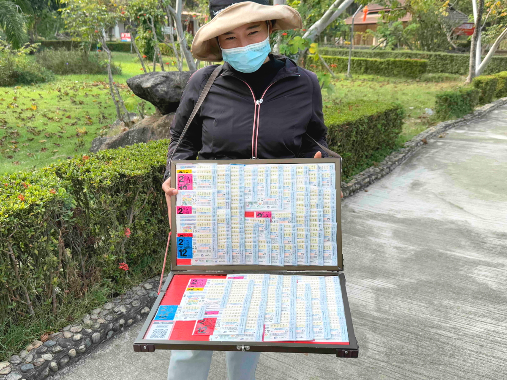

# 20250111_chiangrai

<html>
<head>

<meta charset="UTF-8">
<meta http-equiv="Content-Type" content="text/html; charset=UTF-8">
<meta http-equiv="X-UA-Compatible" content="IE=EmulateIE10" />
<meta http-equiv="X-UA-Compatible" content="IE=edge">

<!--ここから上はお決まりの定型文です-->

<!--ここからが表現の書式などを決めるcssという部分-->

<link href="https://cdnjs.cloudflare.com/ajax/libs/lightbox2/2.7.1/css/lightbox.css" rel="stylesheet">

</head>

<body>

モバイル端末をお使いの場合は、画面を横向きにすると
より見やすくご覧頂けます。

<!--ここ上は、ほぼそのまま使います！-->

<!--QRコードの挿入例-->

 アクセス用QRコード

<marquee direction="left" scrollamount="20" width="30%">(^_^)/~alis</marquee>

<!--流れ文字の挿入例-->
<h1><marquee behavior="left">!!! 2025/01/11 、気温が低いのでパートゥン温泉 !!!</marquee></h1>

                          

<!--ここから下が、本体部分-->

<h2>気温が低くて屋外プールは断念、プール脇にあったアスレチックで遊びました</h2>

<h2>屋外設置されている機器は大学の実習で作ったかのような いかにも手作りでしたが、ちゃんと作動します</h2>

<h2>軽く運動した後はセプンイレブンの敷地内屋台でお昼ご飯</h2>

<h2>先客は中学生くらいの女の子2人</h2>

<h2>鶏肉チャーハンは50バーツ、約230円</h2>

<h2>味は美味しいのですが、食器がひび割れしているのは屋台ではあたりまえ</h2>

<h2>お腹も膨らんだのでパートゥン温泉に向かいます</h2>

<iframe src="https://www.google.com/maps/embed?pb=!4v1736603764853!6m8!1m7!1sprIuDfvFF_vHQnsdfMNGKw!2m2!1d20.11810435907814!2d99.79951004036357!3f298.3850152363104!4f-8.098765692746909!5f0.7820865974627469" width="600" height="450" style="border:0;" allowfullscreen="" loading="lazy" referrerpolicy="no-referrer-when-downgrade"></iframe> 

<h2>敷地内ではどろんこの川で、女の子たちが水遊び</h2>

<h2>スマホ向けるとピースしてくれるのは、熱帯ならではのおおらかさかも</h2>

<h2>土日は市場が開催されてました</h2>

<h2>温泉敷地内の大きな池</h2>

<h2>池の鯉に餌をあげています</h2>

<h2>このエリアにいた部族の衣装</h2>

<h2>温泉施設の壁には日本語で「いらっしゃいませ」</h2>

<h2>王室崇拝も普通にされていました</h2>

<h2>噴水の水に虹がかかりました</h2>

<h2>噴水の脇は、無料の足湯</h2>

<h2>白人さんもスマホで写真撮ってます</h2>

<h2>お花はいつでも満開、さすが熱帯</h2>

<h2>人の集まるところには必ずいる宝くじのお姉様</h2>

<h2>温泉の熱で卵を茹でます</h2>

<h2>ここでも鯉に餌やり</h2>

<h2>噴水の水と風の加減で虹が濃くなります</h2>

<iframe width="560" height="315" src="https://www.youtube.com/embed/6AQesh0hys8?si=kvT5dLkGLlhud4VE" title="YouTube video player" frameborder="0" allow="accelerometer; autoplay; clipboard-write; encrypted-media; gyroscope; picture-in-picture; web-share" referrerpolicy="strict-origin-when-cross-origin" allowfullscreen></iframe> 

<h2>給湯施設の安全を祈るお供物</h2>

<h2>帰り道で見つけた教会は、ブラジルのキリスト像を想像させます</h2>

<h2>11日も夕空にお月様</h2>

<h2>日暮前には、熱帯の太陽が作る天使の梯子</h2>

   
<h2>以上、いつものプールからパートゥン温泉までの映像でした、ここまで観ていただきありがとうございました。</h2>

     
<h2>
<a href="https://torokoid.github.io/20241126_chiangrai/" target="_blank">Back to the menu page</a>
</h2>

   

         

  

      

<!--本体はここまで-->

<!--画面に空白地帯を作って、背景が見えるようにしています-->
                                              

<!-- フッタ -->
<footer>

Copyright 2025/01/12 alis @ChiangRai

</footer>

<!--HPにさまざまなJavaScriptを呼び込むための書式-->

